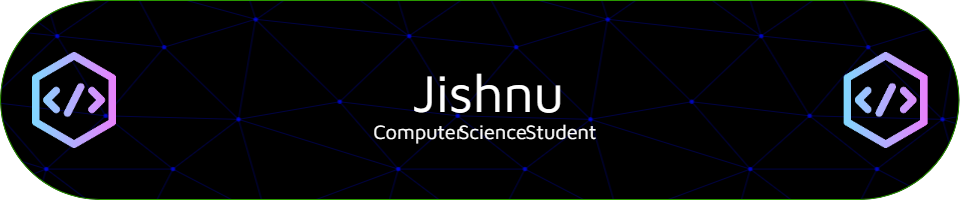

<h1 align="center">Hi 👋, I'm Jishnu R</h1>
<h3 align="center">An ameature programmer form Kerala, India</h3>

- 🌱 I’m currently learning **CSS, JavaScript**

- 📫 How to reach me **jishnu.r7@gmail.com**

- ⚡ Fun fact **I am funny, sarcastic and mildly annoying**

<h3 align="left">Connect with me:</h3>

<h3 align="left">Languages and Tools:</h3>

      

